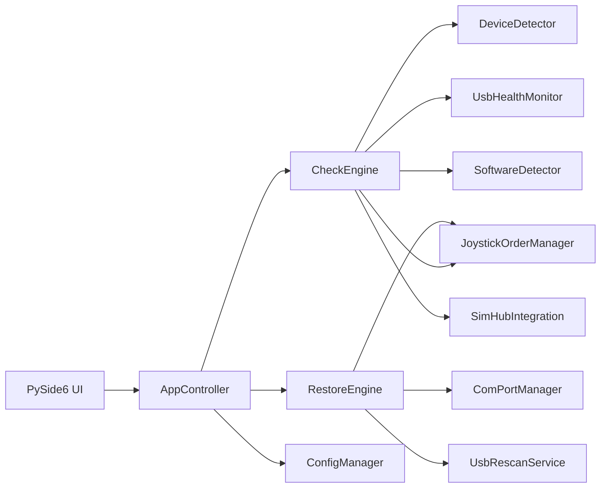

# Architecture

Cockpit Guardian separates user-facing cockpit readiness from Windows-specific
technical details.

## UI

The UI lives in `cockpit_guardian.ui`. It presents cockpit concepts:

- Dashboard readiness status.
- Saved devices.
- Joystick order.
- USB Health summary.
- Software status.
- Settings and Advanced / Debug details.

## Services

Windows details are kept behind service classes:

- `DeviceDetector`: serial/COM and HID discovery.
- `ComPortManager`: COM restore operations.
- `JoystickOrderManager`: joystick order snapshot and restore hook.
- `UsbHealthMonitor`: USB event summaries.
- `UsbTopologyDetector`: best-effort USB 2/3 path information for Dashboard devices.
- `SoftwareDetector`: simracing software detection.
- `SimHubIntegration`: SimHub availability and FFB clipping hook.
- `RestoreEngine`: restore orchestration and rollback.

## Runtime Data

Runtime files are stored outside the install directory:

- Windows: `%APPDATA%\Cockpit Guardian`
- macOS/Linux development: `~/.cockpit_guardian`

## Performance Rules

- Avoid repeated heavy PowerShell scans.
- Cache installed software, HID discovery, and USB event summaries.
- Keep deep Windows metadata scans optional.
- Keep restore operations explicit and backed up.
