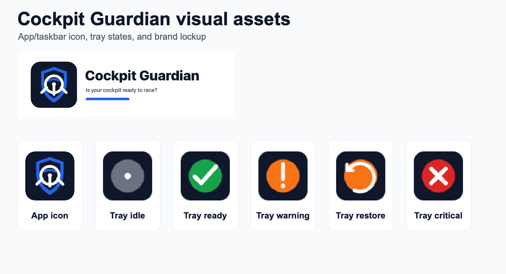

# Visual Assets

Cockpit Guardian now includes a complete first visual asset pack for Windows
desktop distribution.



## Files

- `src/cockpit_guardian/assets/app_icon.svg`: source app icon.
- `src/cockpit_guardian/assets/app_icon.ico`: Windows executable, taskbar,
  installer, and uninstall icon.
- `src/cockpit_guardian/assets/app_icon_256.png`: PySide window/application icon
  source.
- `src/cockpit_guardian/assets/app_icon_64.png`: small app icon export.
- `src/cockpit_guardian/assets/brand_lockup.svg`: logo lockup source.
- `src/cockpit_guardian/assets/brand_lockup.png`: rendered logo lockup.
- `src/cockpit_guardian/assets/tray_idle.png`: no check / unknown state.
- `src/cockpit_guardian/assets/tray_ready.png`: cockpit ready.
- `src/cockpit_guardian/assets/tray_warning.png`: warning.
- `src/cockpit_guardian/assets/tray_restore.png`: restore needed.
- `src/cockpit_guardian/assets/tray_critical.png`: critical device missing.
- `src/cockpit_guardian/assets/asset_preview.png`: generated preview sheet.

## Usage

- The PySide application uses `app_icon_256.png` for the window and taskbar icon.
- The system tray uses the status-specific tray PNG files.
- The Windows build script passes `app_icon.ico` to Nuitka for executable metadata.
- The Inno Setup installer uses `app_icon.ico` as the setup icon.

## Regeneration

Regenerate all visual assets with:

```bash
QT_QPA_PLATFORM=offscreen python tools/generate_assets.py
```

On Windows, omit `QT_QPA_PLATFORM=offscreen`.
